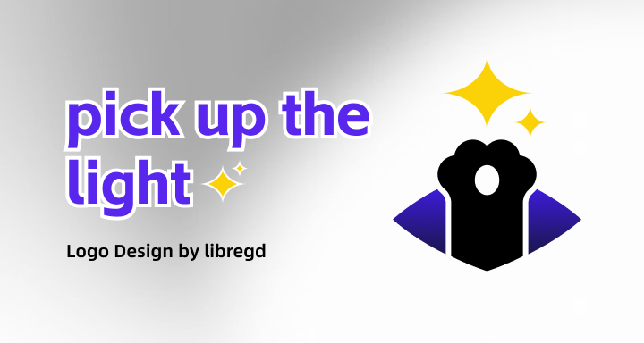

# Background

The project started from frequently coming across interesting things—I call them "light," or maybe "sparks." 

It's not a tool-focused list of recommendations, but something deeper. I'm still figuring out how best to begin.

# Credits
  
This site is built using the Astro [astro-docs-template](https://github.com/advanced-astro/astro-docs-template)  template, with many features removed—mainly because it's not meant for writing open-source technical documentation, but for hosting a personal collection of sparks.

